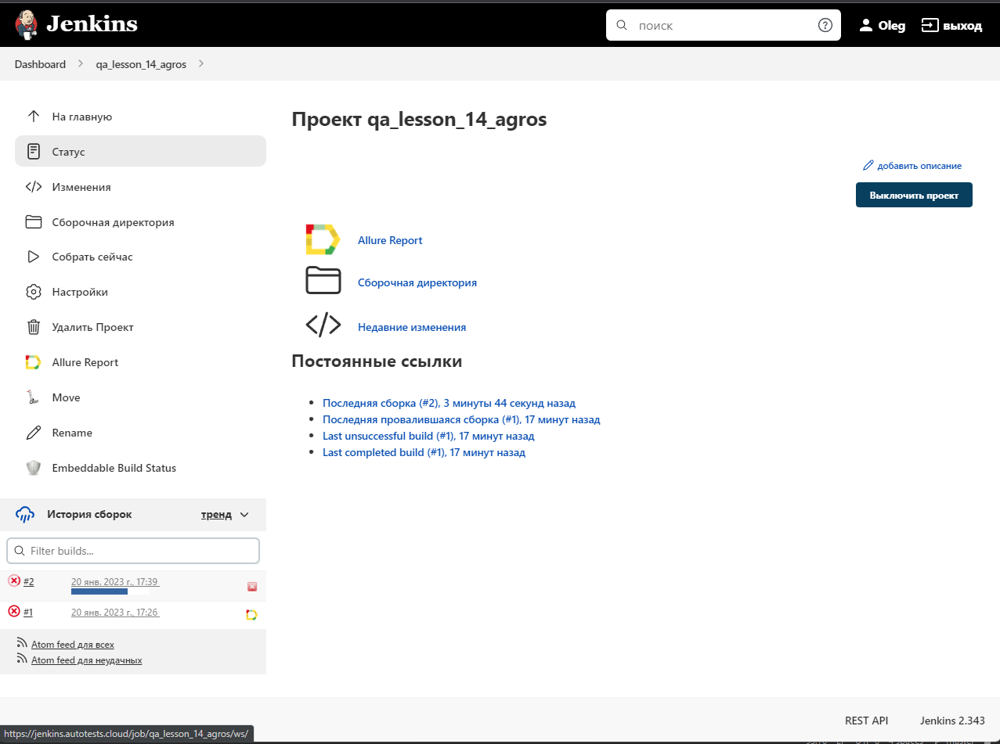
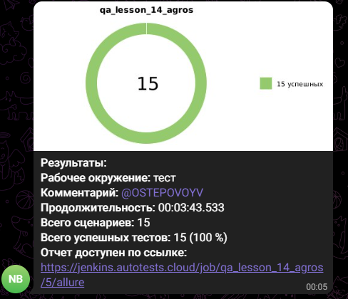
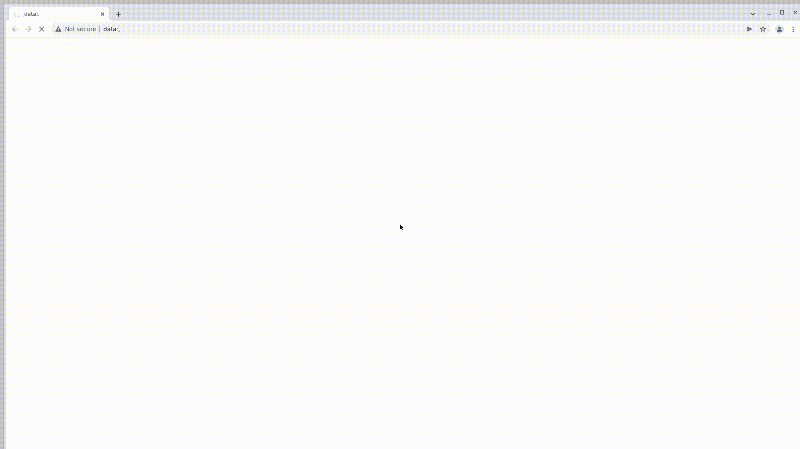

# Проект по автоматизации тестирования интернет-магазина shop.kz

## 	Содержание

> ➠ [Покрытый функционал](#покрытый-функционал)
>
> ➠ [Технологический стек](#технологический-стек)
>
> ➠ [Запуск тестов ](#запуск-тестов)
>
>
> ➠ [Отчет о результатах тестирования в Allure Report](#-главная-страница-allure-отчета)
>
> ➠ [Уведомления в Telegram с использованием бота](#-уведомления-в-telegram-с-использованием-бота)
>
> ➠ [Пример запуска теста в Selenoid](#-пример-запуска-теста-в-selenoid)

##  Покрытый функционал

> Разработаны автотесты на <code>UI</code>.

- [x] Проверка разделов и пунктов меню магазина
- [x] Поиск товара по наименвоанию и артикулу
- [x] Добавление товаров в корзину и возможности оформления 


## Технологический стек

<p align="center">


</p>

### В данном проекте автотесты написаны на <code>Java</code> с использованием <code>Selenide</code> для UI-тестов.
>
> <code>Selenide</code> - это фреймворк для автоматизированного тестирования веб-приложений на основе <code>Selenium WebDriver</code>.
> 
> <code>Selenoid</code> выполняет запуск браузеров в контейнерах <code>Docker</code>.
>
> <code>Allure Report</code> формирует отчет о запуске тестов.
>
> <code>Gradle</code> автоматизированной сборки проекта.
>
> <code>JUnit 5</code> библиотека для модульного тестирования .
>
> <code>Jenkins</code> выполняет запуск тестов.
> 
> После прохождения тестов отправляются уведомления с помощью бота в <code>Telegram</code>.

## Запуск тестов

### Локальный запуск тестов

```
gradle clean test -Denv=local
```

### Запуск тестов удаленно (selenoid)

```
gradle clean test -Denv=remote 
```

### Запуск тестов в Jenkins

#### Для запуска тестов в Jenkins используется команда
```
gradle clean test -Denv=remote
```
#### Для запуска тестов в Jenkins используется <code>remote.proterties</code>
#### Параметры сборки
>
><code>baseUrl</code> – адрес удаленного сервера, на котором будут запускаться тесты.
> 
><code>browser</code> – браузер для тестов.
> 
><code>browserVersion</code> – версия браузера.
> 
><code>browserSize</code> – размер окна браузера.
> 
><code>remoteUrl</code> – адрес удаленного сервера, на котором будут запускаться тесты.
>
><code>pageLoadTimeout</code> – таймаут, для ожидания загрузки страницы.
> 
> <code>isRemote</code> – флаг, определяющий удаленный запуск тестов.


##  Удаленный запуск тестов в Jenkins

<p align="center">

</p>

##  Cтраница Allure отчета

<p align="center">

</p>

##  Список проводимых проверок

<p align="center">

</p>


##  Уведомления в Telegram с использованием бота

> После прохождения всех тестов, автоматически отправялется отчет в<code>Telegram</code>,
> 
> 
> 

<p align="center">

</p>

##  Пример запуска теста в Selenoid

> Для каждого теста в отчете прилагается видео.
> 
> Видео для примера 

<p align="center">

</p>