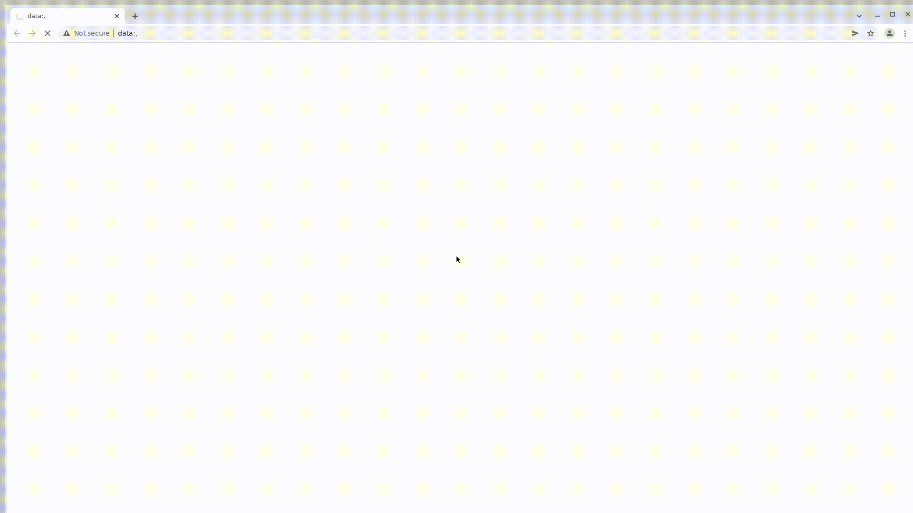

# Дипломный проект по тестированию интернет-магазина [shop.kz](https://shop.kz/)

## :open_book: Содержание:

- [Технологии и инструменты](#gear-технологии-и-инструменты)
- [Тест кейсы](#heavy_check_mark-Тест-кейсы)
- [Запуск тестов](#computer-запуск-тестов)
- [Примеры использования](#примеры-использования)
- [Запуск тестов в Jenkins](#-запуск-тестов-из-jenkins)
- [Отчет о результатах тестирования в Allure Report](#-отчет-о-результатах-тестирования-в-Allure-report)
- [Интеграция с Allure TestOps](#-интеграция-с-allure-testops)
- [Уведомления в Telegram](#-уведомления-в-telegram)
- [Видео прохождения тестов](#movie_camera-видео-с-прогоном-тестов)

## :gear: Технологии и инструменты

<p align="left">
<a href="https://www.jetbrains.com/idea/"></a>
<a href="https://www.java.com/"></a>
<a href="https://github.com/"></a>
<a href="https://junit.org/junit5/"></a>
<a href="https://gradle.org/"></a>
<a href="https://selenide.org/"></a>
<a href="https://aerokube.com/selenoid/"></a>
<a href="https://github.com/allure-framework/allure2"></a>
<a href="https://www.jenkins.io/"></a>
<a href="https://web.telegram.org/"></a>
<a href="https://qameta.io/"></a>
</p>

### В данном проекте автотесты написаны на <code>Java</code> с использованием <code>Selenide</code> для UI-тестов.
>
> Автотесты написаны на <code>Java</code>
>
> <code>Selenide</code> - это фреймворк для автоматизированного тестирования веб-приложений на основе <code>Selenium WebDriver</code>.
>
> <code>Selenoid</code> выполняет запуск браузеров в контейнерах <code>Docker</code>.
>
> <code>Allure Report</code> формирует отчет о запуске тестов.
>
> <code>AllureTestOps</code> используются для запуска тестов и отображения результатов тестирования.
>
> <code>Gradle</code> автоматизированной сборки проекта.
>
> <code>JUnit 5</code> библиотека для модульного тестирования.
>
> <code>Jenkins</code> выполняет запуск тестов.
>
> <code>Selenoid</code> используется для запуска браузеров в контейнерах <code>Docker</code>.
>
> После прохождения тестов отправляются уведомления с помощью бота в <code>Telegram</code>.

## :heavy_check_mark: Тест кейсы

> Разработаны автотесты на <code>UI</code>.

- [x] Успешная авторизация на сайте
- [x] Авторизация на сайте, пользователь не зарегестрирован
- [x] Проверка наличия разделов на главной странице
- [x] Проверка бокового меню
- [x] Проверка горизонтального меню
- [x] Проверка элементов в футере
- [x] Проверка наличия контактной информации
- [x] Проверка доступности и содержимого розничного прайс-листа
- [x] Проверка доступности и содержимого прайс-листа сервисных услуг
- [x] Проверка карточки товара
- [x] Проверка добавления товара в корзину
- [x] Проверка удаления товара из корзины
- [x] Проверка сортировки по имени
- [x] Проверка поиска по названию товара
- [x] Проверка поиска по артикулу

## :computer: Запуск тестов

### Локальный запуск тестов
```
gradle clean test -Denv=local
```
### Запуск тестов удаленно (selenoid)
```
gradle clean test -Denv=remote 
```
### Запуск тестов в Jenkins
#### Для запуска тестов в Jenkins используется команда
```
gradle clean test -Denv=remote
```
#### Для запуска тестов в Jenkins используется <code>remote.proterties</code>

### :earth_asia: Удаленный запуск тестов

```bash
gradle clean test
-Dbrowser=${browser}
-DbrowserVersion=${browserVersion}
-DbrowserSize=${browserSize}
```

## Примеры использования

### Для запуска удаленных тестов необходимо заполнить remote.properties или передать значение:
* baseUrl - основной url
* browser (браузер, по умолчанию chrome)
* browserVersion (версия браузера, по умолчанию 100.0)
* browserSize (размер окна браузера, по умолчанию 1920x1080)
* pageLoadTimeout - переопределение таймаута выставленного по умолчанию
* remoteUrl - url адрес selenoid

Логин и пароль извлекаются из соответствующего файла конфигурации:
```bash
./resources/test.properties
```


#### Параметры сборки
>
><code>baseUrl</code> – адрес удаленного сервера, на котором будут запускаться тесты.
>
><code>browser</code> – браузер для тестов.
>
><code>browserVersion</code> – версия браузера.
>
><code>browserSize</code> – размер окна браузера.
>
><code>remoteUrl</code> – адрес удаленного сервера, на котором будут запускаться тесты.
>
><code>pageLoadTimeout</code> – таймаут, для ожидания загрузки страницы.
>
> Для запуска тестов в несколько потоков необходимо добавить параметр <code>-Dthreads={Количество потоков}</code>
>
> Например: <code>gradle clean test -Dthreads=2</code>


##  Запуск тестов из [Jenkins](https://jenkins.autotests.cloud/job//)
Для запуска сборки необходимо перейти в раздел <code><strong>*Собрать с параметрами*</strong></code> и нажать кнопку <code><strong>*Собрать*</strong></code>.

<p align="center">
  
</p>

После выполнения сборки, в блоке <code><strong>*История сборок*</strong></code> напротив номера сборки появится
значок *Allure Report* и *Allure TestOps* кликнув по которому, откроется страница с сформированным html-отчетом и тестовой документацией.

##  Отчет о результатах тестирования в [Allure Report](https://jenkins.autotests.cloud/job//)

<p align="center">
  
</p>

<p align="center">
  
</p>

##  Интеграция с [Allure TestOps](https://allure.autotests.cloud/launch/)

### Основной дашборд

<p align="center">
  
</p>

### Список тестов с результатами прогона

<p align="center">
  
</p>

### Тест-кейсы

<p align="center">
  
</p>

##  Уведомления в Telegram
После завершения сборки специальный бот, созданный в <code>Telegram</code>, автоматически обрабатывает и отправляет сообщение с отчетом о прогоне тестов.

<p align="center">


## :movie_camera: Видео с прогоном тестов

В отчетах Allure для каждого теста прикреплен не только скриншот, но и видео прохождения теста

<p align="center">
  
</p>
