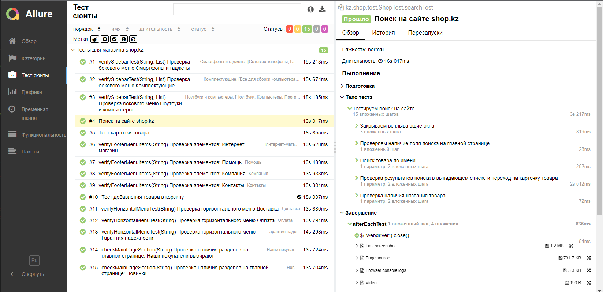

# Дипломный проект по тестированию интернет-магазина [shop.kz](https://shop.kz/)

## :open_book: Содержание:

- [Технологии и инструменты](#-Технологии-и-инструменты)
- [Тест кейсы](#-тест-кейсы)
- [Запуск тестов ](#запуск-тестов)
- [Отчет о результатах тестирования в Allure Report](#-страница-allure-отчета)
- [Уведомления в Telegram с использованием бота](#-уведомления-в-telegram-с-использованием-бота)
- [Пример прохождения теста в Selenoid](#-пример-прохождения-теста-в-selenoid)


## :gear: Технологии и инструменты

<p align="left">
<a href="https://www.jetbrains.com/idea/"></a>
<a href="https://www.java.com/"></a>
<a href="https://github.com/"></a>
<a href="https://junit.org/junit5/"></a>
<a href="https://gradle.org/"></a>
<a href="https://selenide.org/"></a>
<a href="https://aerokube.com/selenoid/"></a>
<a href="https://github.com/allure-framework/allure2"></a>
<a href="https://www.jenkins.io/"></a>
<a href="https://web.telegram.org/"></a>
<a href="https://qameta.io/"></a>
</p>

### В данном проекте автотесты написаны на <code>Java</code> с использованием <code>Selenide</code> для UI-тестов.
>
> Автотесты написаны на <code>Java</code>
> 
> <code>Selenide</code> - это фреймворк для автоматизированного тестирования веб-приложений на основе <code>Selenium WebDriver</code>.
>
> <code>Selenoid</code> выполняет запуск браузеров в контейнерах <code>Docker</code>.
>
> <code>Allure Report</code> формирует отчет о запуске тестов.
> 
> <code>AllureTestOps</code> используются для запуска тестов и отображения результатов тестирования.
>
> <code>Gradle</code> автоматизированной сборки проекта.
>
> <code>JUnit 5</code> библиотека для модульного тестирования .
>
> <code>Jenkins</code> выполняет запуск тестов.
> 
> <code>Selenoid</code> используется для запуска браузеров в контейнерах <code>Docker</code>.
>
> После прохождения тестов отправляются уведомления с помощью бота в <code>Telegram</code>.


##  Тест кейсы

> Разработаны автотесты на <code>UI</code>.

- [x] Проверка разделов и пунктов меню магазина
- [x] Поиск товара по наименвоанию и артикулу
- [x] Добавление товаров в корзину и возможности оформления 


## Запуск тестов

### Локальный запуск тестов

```
gradle clean test -Denv=local
```

### Запуск тестов удаленно (selenoid)

```
gradle clean test -Denv=remote 
```

### Запуск тестов в Jenkins

#### Для запуска тестов в Jenkins используется команда
```
gradle clean test -Denv=remote
```
#### Для запуска тестов в Jenkins используется <code>remote.proterties</code>
#### Параметры сборки
>
><code>baseUrl</code> – адрес удаленного сервера, на котором будут запускаться тесты.
> 
><code>browser</code> – браузер для тестов.
> 
><code>browserVersion</code> – версия браузера.
> 
><code>browserSize</code> – размер окна браузера.
> 
><code>remoteUrl</code> – адрес удаленного сервера, на котором будут запускаться тесты.
>
><code>pageLoadTimeout</code> – таймаут, для ожидания загрузки страницы.
> 
> Для запуска тестов в несколько потоков необходимо добавить параметр <code>-Dthreads={Количество потоков}</code>
> 
> Например: <code>gradle clean test -Dthreads=2</code>
> 


##  Удаленный запуск тестов в Jenkins

<p align="center">

</p>

##  Cтраница Allure отчета

<p align="center">

</p>

##  Список проводимых проверок

<p align="center">

</p>


##  Уведомления в Telegram с использованием бота

> После прохождения всех тестов, автоматически отправляется отчет в<code>Telegram</code>
>

<p align="center">

</p>

##  Пример прохождения теста в Selenoid

> Для каждого теста в отчете прилагается видео.
> 
> Видео для примера. 

<p align="center">

</p>